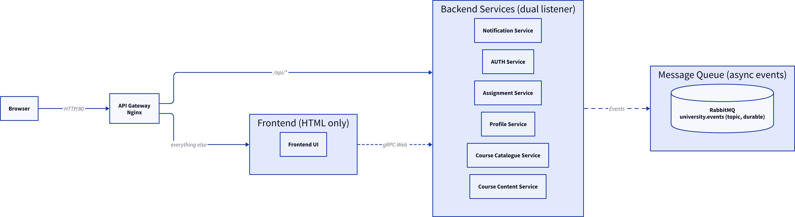

# Osborne.AI - Microservices Project

Osborne.AI is a Student Services Dashboard for a university. It uses a
microservices architecture and is the INFS605 (Microservices) course project.

GitHub: https://github.com/bundgaard1/osbourne.ai

## Setup steps

Prerequisites:

- Go 1.26+
- Docker and Docker Compose
- `buf`, `templ`, `protoc-gen-go`, `protoc-gen-go-grpc` (`make tools` installs them)

Run these commands:

```bash
make generate   # Generates protobufs/gRPC stubs and the frontend templ code
cp .env.example .env   # Optional: override configuration (defaults match the code)
docker compose up --build   # Builds and starts all services in containers
```

- Dashboard: **http://localhost:80**. The API Gateway (Nginx) is the only
  host-exposed application port.
- RabbitMQ management console: **http://localhost:15672** (`guest` / `guest`).

No service publishes a host port. The frontend is not exposed on purpose. It
serves HTML only, and a reachable copy would serve pages that cannot call
`/api/*`.

### Demo accounts

The services seed two accounts on first start. The login page shows the same
details.

| Role    | Email                    | Password    | Name           |
| ------- | ------------------------ | ----------- | -------------- |
| Student | `student@osbourne.local` | `student123` | Andy Osborne   |
| Teacher | `teacher@osbourne.local` | `teacher123` | Dr. Jane Teacher |

Account creation is not available. These seeds are the only accounts.

## Evidence

- **[docs/api-examples.md](docs/api-examples.md)** - real `curl` request and
  response pairs: the login, an enrolment, the notification that follows, and
  the 401/404 error shape.
- **[docs/screenshots/](docs/screenshots/)** - the Docker stack, the UI, the
  RabbitMQ queue counters, one `request_id` in the logs, the error responses,
  and data after `docker compose restart`. The capture plan is in that folder's
  `README.md`.

## Tech stack

- **Go** for all services.
- **Go + Templ + `chi`** for the server-rendered frontend. It serves HTML only.
- **Nginx** for the API Gateway. It routes `/api/*` to the owning service and
  the rest to the frontend, and adds `X-Request-ID`.
- A **dual listener** in every backend: gRPC for internal calls, and a
  **grpc-gateway** REST listener in front of the same server for browser calls.
- **gRPC** for synchronous inter-service calls.
- **RabbitMQ** for asynchronous events, on the durable `university.events`
  topic exchange.
- **Per-service databases**: embedded **SQLite** (GORM) for most, **CloverDB**
  (document store) for course-content. No shared database.

## Architecture



- **Authentication Service** (`auth-service`): credentials, JWT issue and
  validation, and the `account.created` event. Owns the session boundary.
- **Student Profile Service** (`profile-service`): student and staff profile
  data, built from `account.created`.
- **Course Catalogue Service** (`course-catalogue-service`): courses, catalogue,
  and enrolment. Publishes `course.enrolled`.
- **Course Content Service** (`course-content-service`): course content and
  modules (CloverDB).
- **Assignment / Grading Service** (`assignment-service`): assignments,
  submissions (upload and download), and grading. Publishes `grade.published`.
- **Notification Service** (`notification-service`): the notification inbox.
  Consumes `account.created`, `course.enrolled`, and `grade.published`.
- **Frontend UI** (`frontend`): the server-rendered dashboard. Reads from all
  services over gRPC.

The frontend uses gRPC for page data. Browser `/api/*` calls go through the
gateway to the owning service's REST listener, which turns them back into gRPC
so the same auth and logging interceptors apply. The browser never receives a
JWT: auth-service sends it in an `HttpOnly` cookie, removes it from the JSON
body, and derives the role on the server. The login form has no role input.
Shared code (logging, JWT parsing, gRPC interceptors, the gateway listener,
request-ID correlation) is in the `common` module.

## API endpoints

Every browser call goes to the gateway at `http://localhost` and is served by
the owning service's REST listener. The frontend serves HTML only. The surface
has **25 endpoints**: 23 from the protobuf `google.api.http` annotations, plus
two hand-written streaming routes. Authenticated routes need the session cookie
or an explicit `Authorization: Bearer` header. Every failure uses the JSON shape
in [docs/api-examples.md](docs/api-examples.md).

### auth-service

| Method | Path | Description |
| --- | --- | --- |
| `POST` | `/api/auth/login` | Validate credentials, set the `HttpOnly` session cookie |
| `POST` | `/api/auth/validate` | Introspect a token |
| `POST` | `/api/auth/logout` | Expire the session cookie |

### profile-service

| Method | Path | Description |
| --- | --- | --- |
| `GET` | `/api/profile` | Current user's profile |
| `PUT` | `/api/profile` | Replace the current user's profile |

### course-catalogue-service

| Method | Path | Description |
| --- | --- | --- |
| `GET` | `/api/courses` | List courses (paginated: `page`, `page_size`) |
| `GET` | `/api/courses/{course_id}` | One course |
| `POST` | `/api/enrollments` | Enrol the current user in a course |
| `GET` | `/api/enrollments/me` | Courses the current user is enrolled in |

### course-content-service

| Method | Path | Description |
| --- | --- | --- |
| `GET` | `/api/courses/{course_id}/modules` | List a course's modules |
| `POST` | `/api/courses/{course_id}/modules` | Create a module |
| `GET` | `/api/courses/{course_id}/modules/{module_id}` | One module |
| `PUT` | `/api/courses/{course_id}/modules/{module_id}` | Update a module |
| `DELETE` | `/api/courses/{course_id}/modules/{module_id}` | Delete a module |

### assignment-service

| Method | Path | Description |
| --- | --- | --- |
| `GET` | `/api/courses/{course_id}/assignments` | Assignments for a course |
| `POST` | `/api/courses/{course_id}/assignments` | Create an assignment |
| `GET` | `/api/assignments/{assignment_id}` | One assignment |
| `GET` | `/api/assignments/{assignment_id}/submissions` | All submissions for an assignment |
| `GET` | `/api/assignments/{assignment_id}/submissions/mine` | The caller's submissions |
| `GET` | `/api/submissions/{submission_id}` | One submission |
| `POST` | `/api/submissions/{submission_id}/grade` | Grade a submission |
| `POST` | `/api/assignments/{assignment_id}/submissions` | Upload a submission (multipart, streaming) |
| `GET` | `/api/submissions/{submission_id}/file` | Download a submission (binary, streaming) |

The last two are hand-written (`mux.HandlePath`), not generated. They stream a
file instead of base64-encoding it in JSON. The application caps uploads at
10 MB. Nginx allows 12 MB for the multipart envelope.

### notification-service

| Method | Path | Description |
| --- | --- | --- |
| `GET` | `/api/notifications` | The caller's notifications |
| `POST` | `/api/notifications/{notification_id}/read` | Mark one notification read |

## Testing process

**Go tests and vet, per module.** The repo is a `go.work` workspace. Run `./...`
inside each module:

```bash
for m in common frontend auth-service profile-service notification-service \
         course-catalogue-service course-content-service assignment-service; do
  (cd "$m" && go test ./... && go vet ./...)
done
```

**Gateway routing.** The `/api/*` routes are regex-ordered. `nginx -t` cannot
see a wrong order: every route parses and the wrong route wins. `routing-test.sh`
runs the route table against stub upstreams and checks which service gets each
path, the JSON 404 catch-all, query-string preservation, cookie to bearer
promotion, and the 12 MB body limit:

```bash
./nginx/routing-test.sh   # requires docker
```

**Manual end-to-end.** Run `docker compose up --build`, then use the UI and the
documented `curl` calls. The captured results are the evidence in
[docs/api-examples.md](docs/api-examples.md) and
[docs/screenshots/](docs/screenshots/).

## Known limitations

- **gRPC is unencrypted.** Internal traffic uses `insecure` credentials, with no
  TLS or mTLS. Acceptable on the private Compose network, not production-ready.
- **RabbitMQ uses the stock `guest:guest` credentials**, and the management
  dashboard is at `localhost:15672`. Docker Compose does not interpolate `.env`
  into the service `environment:` blocks, so these are not configurable from
  `.env` (noted in `.env.example`).
- **No rate limiting** on the gateway or any service.
- **No health checks** on the Go services. No service exposes `/healthz` and
  none has a Docker `HEALTHCHECK`; only RabbitMQ has one.
- **The notification consumer is not idempotent.** RabbitMQ delivery is
  at-least-once, so a redelivered event can create a duplicate notification.

## Docs

- [API examples](docs/api-examples.md) - real `curl` request and response pairs from a running stack, including the failures.
- [Design document](docs/design.md) - architecture, isolation, service endpoints, event catalog, and request correlation.
- [Plan / issues](docs/plan.md) - the implementation plan and known issues.
- [Notes](docs/notes.md) - project notes.
