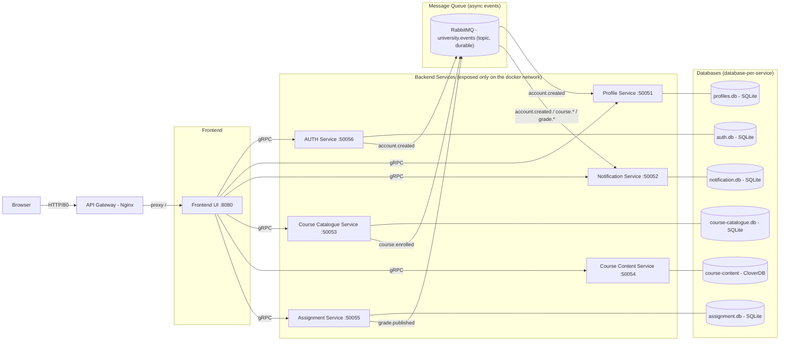
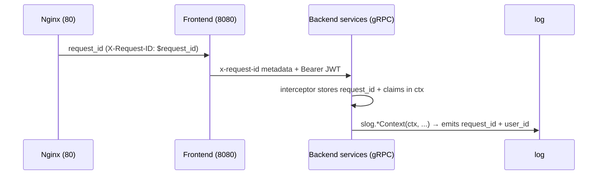

Design Documentation
===================

# Overview

Osborne.AI is a Student Services Dashboard built with a microservices architecture. A single **Frontend UI** is the only client-facing application; it talks to the backend services over gRPC, and the services coordinate asynchronously through RabbitMQ events. The **API Gateway** (Nginx) is the only ingress into the platform.



# Communication

## Synchronous: gRPC

The frontend is the orchestrator. Every page load fans out to one or more backend services over gRPC to fetch the data needed to render the page. Examples of service calls for each frontend route are shown below.

| Path | Services called |
| --- | --- |
| `/login` | auth-service |
| Any authenticated page | profile-service (always, for the display name) |
| `/course-catalog` | course-catalogue-service |
| `/courses/{id}` | course-catalogue-service, course-content-service, assignment-service |
| `/courses/{id}/assignments/{aid}` | assignment-service |
| `/notifications` | notification-service |

All gRPC calls carry an `Authorization: Bearer <JWT>` token and the `x-request-id` metadata header.

## Asynchronous: RabbitMQ events

Domain events are published on the durable **topic exchange `university.events`**. Publishers use persistent delivery, and consumer queues are durable, so messages survive consumer downtime and are drained on startup.

| Event | Published by | Routing key | Consumed by |
| --- | --- | --- | --- |
| `account.created` | auth-service | `account.created` | profile-service (`profile_service_queue`), notification-service (`notification_service_queue`) |
| `course.enrolled` | course-catalogue-service | `course.enrolled` | notification-service |
| `grade.published` | assignment-service | `grade.published` | notification-service |

# Isolation

## Services

All services run on a single Docker Compose bridge network. The only entrance is the API Gateway (Nginx), which routes `/` to the frontend and sets the `X-Request-ID` header. Backend services are **not** exposed on the host; only the frontend and the RabbitMQ management port are reachable.

## Databases

The platform follows a **database-per-service** model: each service owns its own store and there is no shared or cross-domain storage.

- SQLite (embedded, via GORM / `glebarez/sqlite`): auth, profile, notification, course-catalogue, assignment.
- CloverDB (embedded document store): course-content.
- Local file storage: assignment submissions (uploaded files).

State is only exchanged through well-defined gRPC APIs and domain events.

# Authentication & session flow

1. The user logs in at `/login` and the frontend calls `auth.AuthService.Login`.
2. Auth-service validates credentials and returns a signed **JWT**.
3. The frontend stores the token in an `HttpOnly` session cookie.
4. For every subsequent gRPC call, the frontend attaches the token as `Authorization: Bearer <token>`.
5. A shared gRPC **unary interceptor** (`auth-common` `AuthInterceptor`) verifies the JWT on each backend service and injects the decoded claims into the request context. Invalid/missing tokens are rejected with `Unauthenticated`.

# Observability & request correlation

All services log **JSON** to stdout via `log/slog`, configured by `auth-common.SetupLogging`.

Every log record is enriched —

- `service`: the emitting component.
- `request_id`: correlation ID for one end-to-end request.
- `user_id`: pulled from the verified JWT claims in the context.

## How `request_id` flows across the stack



1. **Nginx** generates a unique `$request_id` and forwards it as the `X-Request-ID` header.
2. The frontend picks it up in a `chi` request middleware and forwards it on every outgoing gRPC call as the `x-request-id` metadata key.
3. Each backend's gRPC interceptor copies the header into the request context (`WithRequestID`) alongside the JWT claims (`WithClaims`).
4. The shared `slog` handler (`contextHandler`) reads both from the context on every `slog.*Context` call, so **each service hop logs the same `request_id` without threading attributes through call sites**.

A single trace can be reconstructed by grepping the whole log stream for one `request_id`.

## Keeping the log stream pure JSON

- `RabbitLogger` implements go-rabbitmq's `Logger` interface and mirrors its console chatter through `slog`.
- `GormLogger` is a slog-backed GORM logger that emits only genuine errors (dropping the expected `RecordNotFound` lookups) instead of raw SQL at production levels.

## Example trace — student course enrolment

`POST /api/courses/enroll` (as `student@osbourne.local`) produces logs carrying the same `request_id`:

Frontend:

```json
{"msg":"http request","service":"frontend","method":"POST","path":"/api/courses/enroll","status":200,"request_id":"a1b2c3...","user_id":"12345"}
```

Course Catalogue Service:

```json
{"msg":"received get_course request","service":"course-catalogue-service","course_id":"1","request_id":"a1b2c3...","user_id":"12345"}
{"msg":"received enroll_user request","service":"course-catalogue-service","course_id":"1","request_id":"a1b2c3...","user_id":"12345"}
{"msg":"published course.enrolled event","service":"course-catalogue-service","student_id":"12345","course_id":"1","event_id":"...","request_id":"a1b2c3...","user_id":"12345"}
```

Notification Service (async, correlates on `event_id` instead of `request_id`):

```json
{"msg":"received event","service":"notification-service","event_id":"...","event_type":"course.enrolled"}
```

# Service endpoints

## gRPC (internal, accessed by the frontend)

| Service | Methods |
| --- | --- |
| `auth.AuthService` | `Login`, `ValidateToken` |
| `user.profile.ProfileService` | `GetUserProfile` |
| `coursecatalogue.CourseCatalogueService` | `GetCourse`, `ListCourses`, `EnrollUser`, `ListEnrolledCourses` |
| `course_content.v1.CourseContentService` | `CreateModule`, `GetModule`, `UpdateModule`, `DeleteModule`, `ListModulesByCourseID` |
| `notification.catalogue.NotificationService` | `GetUserNotifications`, `MarkNotificationAsRead` |
| `assignment.AssignmentService` | `CreateAssignment`, `GetCourseAssignments`, `GetAssignment`, `GetSubmission`, `ListSubmissions`, `ListMySubmissions`, `GradeSubmission`, `SubmitAssignment` (client streaming), `DownloadSubmission` (server streaming) |

## HTTP (frontend)

| Method | Path | Action |
| --- | --- | --- |
| GET | `/login` | Login page |
| POST | `/login` | Authenticate and set session cookie |
| POST | `/logout` | Clear session |
| GET | `/` | Dashboard |
| GET | `/profile` | Profile page |
| GET | `/notifications` | Notification inbox |
| GET | `/course-catalog` | Course catalog |
| GET | `/courses/{courseID}` | Course details + content + assignments |
| GET | `/courses/{courseID}/assignments/{assignmentID}` | Assignment detail |
| POST | `/api/courses/enroll` | Enrol in a course |
| POST | `/api/assignments/{assignmentID}/submit` | Submit an assignment |
| GET | `/api/submissions/{submissionID}/download` | Download a submission |
| POST | `/api/submissions/{submissionID}/grade` | Grade a submission |
| POST | `/api/notifications/{notificationID}/mark-read` | Mark a notification read |

# Ports & stack

| Component | Port(s) |
| --- | --- |
| API Gateway (Nginx) | `80` |
| Frontend | `8080` |
| RabbitMQ (AMQP / management) | `15672` (management) <br> `5672` (internal) |
| auth-service | `50056` (internal) |
| profile-service | `50051` (internal) |
| notification-service | `50052` (internal) |
| course-catalogue-service | `50053` (internal) |
| course-content-service | `50054` (internal) |
| assignment-service | `50055` (internal) |

| Technology | Used for |
| --- | --- |
| Go + `log/slog` | All services, structured JSON logging |
| Protobuf + gRPC | Type-safe internal synchronous communication |
| RabbitMQ | Asynchronous event-driven processing |
| GORM + SQLite | Relational persistence (per service) |
| CloverDB | Document store for course content |
| Templ + `chi` | Server-rendered frontend |
| Nginx | API Gateway |
| Docker Compose | Deployment and service isolation |

For the implementation plan and the list of known issues, see [plan.md](plan.md) and [notes.md](notes.md).