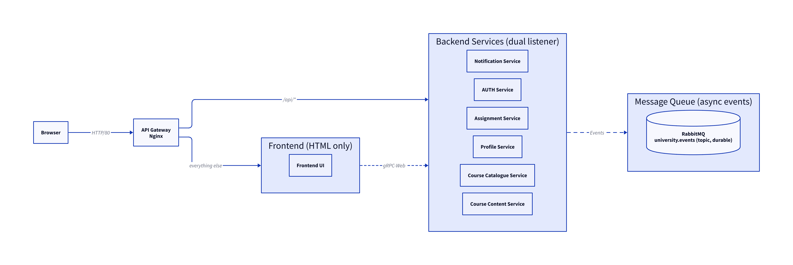
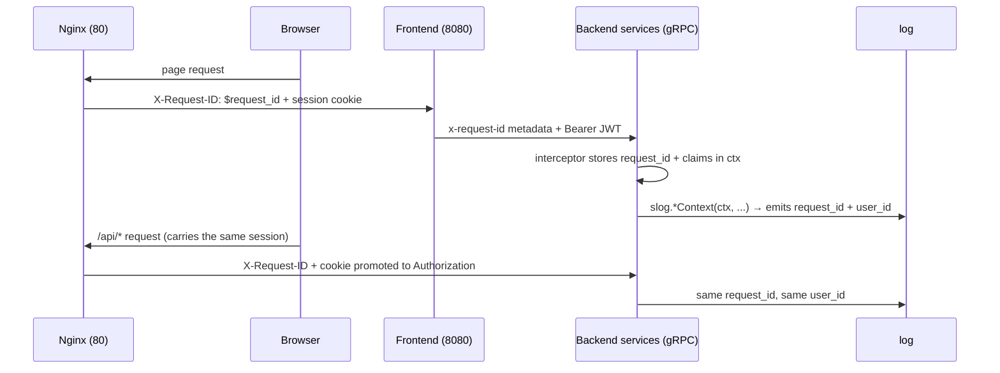

Design Documentation
===================

# Overview

Osborne.AI is a Student Services Dashboard built with a microservices architecture. A single **Frontend UI** is the only client-facing application. It server-renders the pages and reaches the backend services over gRPC; every other browser-facing call is served by the owning service itself, through the **API Gateway** (Nginx), the only ingress into the platform.

Every service runs a **dual listener**: a gRPC server for internal service-to-service traffic, and a grpc-gateway REST listener that fronts that same gRPC server. The REST listener is what the browser reaches, and it deliberately dials gRPC over loopback rather than calling the implementation in-process, so the same interceptors that guard internal traffic also guard browser traffic.



# Communication

## Synchronous: two paths

There are two distinct synchronous paths, and they do not overlap:

| Caller | Path | Used for |
| --- | --- | --- |
| Frontend (server-side) | gRPC direct to the service | Data needed to render an HTML page |
| Browser (client-side) | HTTP → nginx → the owning service's REST listener | Enrol, submit, download, grade, mark-read, login/logout |

The split is the point of the current design: the frontend serves HTML and nothing else. A `/api/*` path that reaches it is a misroute, not a missing handler.

### Frontend → gRPC, for page rendering

Every page load fans out to one or more backend services over gRPC.

| Path | Services called |
| --- | --- |
| `/login` | none (the page posts to the API) |
| Any authenticated page | profile-service (always, for the display name) |
| `/course-catalog` | course-catalogue-service |
| `/courses/{id}` | course-catalogue-service, course-content-service, assignment-service |
| `/courses/{id}/assignments/{aid}` | assignment-service |
| `/notifications` | notification-service |

All frontend gRPC calls carry `Authorization: Bearer <JWT>` and `x-request-id` metadata.

### Browser → REST, through the gateway

The browser's `/api/*` calls are routed by nginx to the service that owns the path. Each service's REST listener translates the HTTP request back into a gRPC call to its own server, so `common.AuthInterceptor` and the request-logging interceptor apply to browser traffic exactly as they do to internal calls.

Nginx matches the `/api` routes with **regex** locations rather than prefix ones, because prefix matching cannot express "the second path segment is literally `modules`". Order matters — the first match wins — so the more specific `/api/courses/{id}/...` routes are listed before the catalogue's catch-all.

| Nginx location | Service |
| --- | --- |
| `/api/auth/*` | auth-service |
| `/api/profile/*` | profile-service |
| `/api/notifications/*` | notification-service |
| `/api/courses/{id}/modules/*` | course-content-service |
| `/api/courses/{id}/assignments/*` | assignment-service |
| `/api/assignments/{id}/submissions$` | assignment-service (upload, buffered off) |
| `/api/submissions/{id}/file$` | assignment-service (download, buffered off) |
| `/api/(assignments\|submissions)(/\|$)` | assignment-service |
| `/api/(courses\|enrollments)(/\|$)` | course-catalogue-service |
| `/api/` | 404 JSON, answered by nginx itself |
| `/` | frontend |

A few nginx settings are load-bearing rather than cosmetic:

- **Upstreams are held in variables.** A literal hostname is resolved at config-parse time, so `nginx -t` fails unless every backend is already reachable, and a recreated container's new IP stays cached by a running gateway. A variable defers resolution to request time.
- **`client_max_body_size 12m`.** Nginx's 1 MB default would reject a large upload with a bare 413 and no JSON body. The application enforces its own 10 MB cap, so the gateway limit is deliberately set above it.
- **The two streaming routes disable proxy buffering.** Without `proxy_request_buffering off`, nginx reads the whole upload to a temp file before proxying, defeating the streaming and doubling disk per concurrent upload. `proxy_http_version 1.1` is mandatory for the same reason — a chunked body cannot be forwarded over the default 1.0.
- **The `/api/` catch-all returns JSON.** Otherwise an unrouted API path would fall through to `location /` and be answered with the frontend's HTML, leaving a JSON client to fail on a syntax error instead of an actionable 404.

## Asynchronous: RabbitMQ events

Domain events are published on the durable **topic exchange `university.events`**. Publishers use persistent delivery, and consumer queues are durable, so messages survive consumer downtime and are drained on startup.

| Event | Published by | Routing key | Consumed by |
| --- | --- | --- | --- |
| `account.created` | auth-service | `account.created` | profile-service (`profile_service_queue`), notification-service (`notification_service_queue`) |
| `course.enrolled` | course-catalogue-service | `course.enrolled` | notification-service |
| `grade.published` | assignment-service | `grade.published` | notification-service |

# Isolation

## Services

All services run on a single Docker Compose bridge network. The only entrance is the API Gateway (Nginx) on port 80. **No backend service and not the frontend are published on a host port** — the frontend in particular is deliberately unexposed, because a directly reachable copy would serve pages whose `/api/*` calls go nowhere, so the login form would post into a void.

The REST listeners are reachable only from the gateway, on the shared Docker network.

## Databases

The platform follows a **database-per-service** model: each service owns its own store and there is no shared or cross-domain storage.

- SQLite (embedded, via GORM): auth, profile, notification, course-catalogue, assignment.
- CloverDB (embedded document store): course-content.
- Local file storage: assignment submissions (uploaded files).

State is only exchanged through well-defined gRPC APIs, REST endpoints, and domain events.

# Authentication & session flow

auth-service owns the session boundary. The browser never sees the token, and the frontend is not in the login path at all.

1. The browser posts JSON credentials to `POST /api/auth/login` (nginx → auth-service's REST listener → gRPC → `auth.AuthService.Login`).
2. auth-service validates the credentials and signs a **JWT** carrying the user's ID, email, and role.
3. The response sets the token as an **`HttpOnly`** `osbourne_session` cookie. A forward-response option clears the token from the JSON body, so an XSS on any page cannot read it out of the response — the cookie is the only delivery path. (The gRPC path still returns the token, because the frontend's server-side handlers call `Login` directly and need it.)
4. The user's **role is derived server-side** from the account record and baked into the JWT. The login form takes no role input.
5. For every subsequent call, nginx promotes the cookie into `Authorization: Bearer <token>`, which is what `common.AuthInterceptor` reads. An `Authorization` header supplied by the client takes precedence, so `curl` and Postman work without a cookie.
6. Each service verifies the JWT in its interceptor and injects the decoded claims into the request context. Invalid or missing tokens are rejected with `Unauthenticated`.

Nginx also strips the `Cookie` header before proxying to a backend, so the raw token never appears in a service's access log. `common.IncomingHeaderMatcher` refuses to forward `Cookie` into gRPC metadata as a second layer.

Streaming RPCs are covered by a separate `common.AuthStreamInterceptor`: the unary interceptor does not apply to them, and without it `SubmitAssignment` accepted any uploader ID and `DownloadSubmission` served any submission. It wraps `grpc.ServerStream` to place verified claims in the stream context, which is where `SubmitAssignment` reads the uploader from.

## Logout

`POST /api/auth/logout` is an API call, not a form post. auth-service owns the cookie and is the only component that can clear it; a plain form post would land the browser on a JSON body instead of the login page.

# Observability & request correlation

All services log **JSON** to stdout via `log/slog`, configured by `common.SetupLogging`.

Every log record is enriched —

- `service`: the emitting component.
- `request_id`: correlation ID for one end-to-end request.
- `user_id`: pulled from the verified JWT claims in the context.

## How `request_id` flows across the stack


```mermaid
sequenceDiagram
    participant NG as Nginx (80)
    participant B as Browser
    participant F as Frontend (8080)
    participant S as Backend services (gRPC)
    B->>NG: page request
    NG->>F: X-Request-ID: $request_id + session cookie
    F->>S: x-request-id metadata + Bearer JWT
    S->>S: interceptor stores request_id + claims in ctx
    S->>log: slog.*Context(ctx, ...) → emits request_id + user_id
    B->>NG: /api/* request (carries the same session)
    NG->>S: X-Request-ID + cookie promoted to Authorization
    S->>log: same request_id, same user_id
```

1. **Nginx** generates a unique `$request_id` per request, forwards it as `X-Request-ID`, and echoes it back as a response header so it is reachable from the browser's network tab.
2. The frontend adopts nginx's id rather than chi's — chi's `middleware.RequestID` always mints a fresh one and ignores the inbound value, which would give a page load and the API calls it triggers unrelated ids. The adopted id is forwarded on every outgoing gRPC call as `x-request-id`.
3. Each backend's interceptor copies the header into the request context (`WithRequestID`) alongside the JWT claims (`WithClaims`), and the gateway maps the header onto the gRPC metadata key.
4. The shared `slog` handler reads both from the context on every `slog.*Context` call, so **each service hop logs the same `request_id` without threading attributes through call sites**.

A single trace can be reconstructed by grepping the whole log stream for one `request_id`.

## Keeping the log stream pure JSON

Every process emits **JSON structured logs** to stdout via `log/slog`:

```json
{"time":"...","level":"INFO","msg":"received enroll_user request","service":"course-catalogue-service","course_id":"1","request_id":"...","user_id":"12345"}
```

Log lines are enriched with:

- `service` — which component logged it.
- `request_id` — a correlation ID propagated across the whole stack (Nginx `$request_id` → `X-Request-ID` header → frontend gRPC metadata → downstream services). Whole traces can be followed by grepping on one ID.
- `user_id` — injected from the verified JWT claims.

Per-service log level is configurable via the `LOG_LEVEL` env var (`debug | info | warn | error`); GORM and go-rabbitmq chatter is routed through `slog` so the stream stays pure JSON.

## Logging adapters

- `RabbitLogger` implements go-rabbitmq's `Logger` interface and mirrors its console chatter through `slog`.
- `GormLogger` is a slog-backed GORM logger that emits only genuine errors (dropping the expected `RecordNotFound` lookups) instead of raw SQL at production levels.

## Example trace — student course enrolment

`POST /api/enrollments` (as `student@osbourne.local`) produces logs carrying the same `request_id`:

Course Catalogue Service:

```json
{"msg":"received get_course request","service":"course-catalogue-service","course_id":"1","request_id":"a1b2c3...","user_id":"12345"}
{"msg":"received enroll_user request","service":"course-catalogue-service","course_id":"1","request_id":"a1b2c3...","user_id":"12345"}
{"msg":"published course.enrolled event","service":"course-catalogue-service","student_id":"12345","course_id":"1","event_id":"...","request_id":"a1b2c3...","user_id":"12345"}
```

Notification Service (async, correlates on `event_id` instead of `request_id`):

```json
{"msg":"received event","service":"notification-service","event_id":"...","event_type":"course.enrolled"}
```

# Service endpoints

## gRPC (internal, and used by the frontend for page rendering)

| Service | Methods |
| --- | --- |
| `auth.AuthService` | `Login`, `ValidateToken`, `Logout` |
| `user.profile.ProfileService` | `GetUserProfile`, `UpdateUserProfile` |
| `coursecatalogue.CourseCatalogueService` | `ListCourses`, `GetCourse`, `EnrollUser`, `ListEnrolledCourses` |
| `course_content.CourseContentService` | `CreateModule`, `GetModule`, `UpdateModule`, `DeleteModule`, `ListModulesByCourseID` |
| `notification.catalogue.NotificationService` | `GetUserNotifications`, `MarkNotificationAsRead` |
| `assignment.AssignmentService` | `CreateAssignment`, `GetCourseAssignments`, `GetAssignment`, `GetSubmission`, `ListSubmissions`, `ListMySubmissions`, `GradeSubmission`, `SubmitAssignment` (client streaming), `DownloadSubmission` (server streaming) |

## REST (browser-facing, via the gateway)

Generated from `google.api.http` annotations in the protos and served by each service's grpc-gateway listener on its internal `:8080`.

| Method | Path | Service | RPC |
| --- | --- | --- | --- |
| POST | `/api/auth/login` | auth | `Login` |
| POST | `/api/auth/validate` | auth | `ValidateToken` |
| POST | `/api/auth/logout` | auth | `Logout` |
| GET | `/api/profile` | profile | `GetUserProfile` |
| PUT | `/api/profile` | profile | `UpdateUserProfile` |
| GET | `/api/courses` | catalogue | `ListCourses` |
| GET | `/api/courses/{course_id}` | catalogue | `GetCourse` |
| POST | `/api/enrollments` | catalogue | `EnrollUser` |
| GET | `/api/enrollments/me` | catalogue | `ListEnrolledCourses` |
| POST | `/api/courses/{course_id}/modules` | content | `CreateModule` |
| GET | `/api/courses/{course_id}/modules` | content | `ListModulesByCourseID` |
| GET | `/api/courses/{course_id}/modules/{module_id}` | content | `GetModule` |
| PUT | `/api/courses/{course_id}/modules/{module_id}` | content | `UpdateModule` |
| DELETE | `/api/courses/{course_id}/modules/{module_id}` | content | `DeleteModule` |
| POST | `/api/courses/{course_id}/assignments` | assignment | `CreateAssignment` |
| GET | `/api/courses/{course_id}/assignments` | assignment | `GetCourseAssignments` |
| GET | `/api/assignments/{assignment_id}` | assignment | `GetAssignment` |
| GET | `/api/assignments/{assignment_id}/submissions` | assignment | `ListSubmissions` |
| GET | `/api/assignments/{assignment_id}/submissions/mine` | assignment | `ListMySubmissions` |
| GET | `/api/submissions/{submission_id}` | assignment | `GetSubmission` |
| POST | `/api/submissions/{submission_id}/grade` | assignment | `GradeSubmission` |
| GET | `/api/notifications` | notification | `GetUserNotifications` |
| POST | `/api/notifications/{notification_id}/read` | notification | `MarkNotificationAsRead` |

### Streaming routes (hand-written)

`SubmitAssignment` and `DownloadSubmission` carry no `google.api.http` annotation on purpose: they are client- and server-streaming, and a generated handler would carry the file as base64 inside JSON. They are served by hand-written `http.Handlers` mounted on the same mux.

| Method | Path | Direction | Notes |
| --- | --- | --- | --- |
| POST | `/api/assignments/{assignment_id}/submissions` | client streaming | multipart upload, 10 MB cap |
| GET | `/api/submissions/{submission_id}/file` | server streaming | binary download |

## HTML (frontend)

The frontend serves pages and static assets only. It has no `/api/*` routes.

| Method | Path | Action |
| --- | --- | --- |
| GET | `/login` | Login page (posts to `/api/auth/login`) |
| GET | `/` | Dashboard |
| GET | `/profile` | Profile page |
| GET | `/notifications` | Notification inbox |
| GET | `/course-catalog` | Course catalog |
| GET | `/courses/{courseID}` | Course details + content + assignments |
| GET | `/courses/{courseID}/assignments/{assignmentID}` | Assignment detail |
| GET | `/static/*` | Static assets |

## Generated OpenAPI document

A combined OpenAPI description of the annotated routes is generated to `proto/openapi/osbourne.swagger.json` (via `make generate`). It covers the generated gateway routes but not the two hand-written streaming routes above, which have no proto annotation.

# Ports & stack

| Component | Port(s) |
| --- | --- |
| API Gateway (Nginx) | `80` (only host-exposed application port) |
| RabbitMQ (AMQP / management) | `15672` (management) <br> `5672` (internal) |
| auth-service | `50056` (gRPC) / `8080` (REST) — internal |
| profile-service | `50051` (gRPC) / `8080` (REST) — internal |
| notification-service | `50052` (gRPC) / `8080` (REST) — internal |
| course-catalogue-service | `50053` (gRPC) / `8080` (REST) — internal |
| course-content-service | `50054` (gRPC) / `8080` (REST) — internal |
| assignment-service | `50055` (gRPC) / `8080` (REST) — internal |
| frontend | `8080` — internal, not published to the host |

Every backend REST listener is set to `8080` explicitly in `docker-compose.yml`, because `nginx.conf` hard-codes that port for all backends. A silent change to the default would 502 every API route.

| Technology | Used for |
| --- | --- |
| Go + `log/slog` | All services, structured JSON logging |
| Protobuf + gRPC | Type-safe internal synchronous communication |
| grpc-gateway | REST listener in front of each service's gRPC server |
| RabbitMQ | Asynchronous event-driven processing |
| GORM + SQLite | Relational persistence (per service) |
| CloverDB | Document store for course content |
| Templ + `chi` | Server-rendered frontend |
| Nginx | API Gateway and sole ingress |
| Docker Compose | Deployment and service isolation |

For the implementation plan and the list of known issues, see [plan.md](plan.md) and [notes.md](notes.md).
