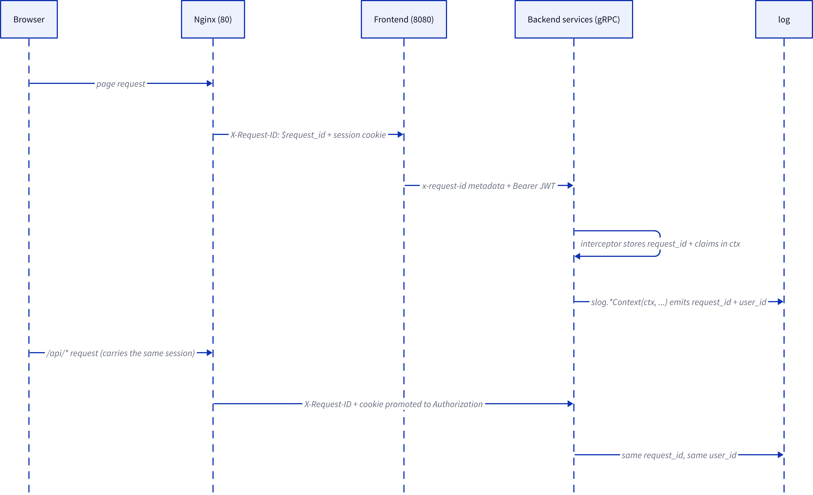

# Design Documentation

## Overview

Osborne.AI is a Student Services Dashboard with a microservices architecture.
The **Frontend UI** is the only client-facing application. It server-renders the
pages and calls the backend services over gRPC. The **API Gateway** (Nginx) is
the only ingress; every other browser call goes through it to the owning
service.

Every service runs a **dual listener**: a gRPC server for internal calls, and a
grpc-gateway REST listener in front of the same server. The REST listener dials
gRPC over loopback instead of calling the implementation in-process.


## Communication

### Synchronous: two paths

There are two synchronous paths. They do not overlap.

| Caller | Path | Use |
| --- | --- | --- |
| Frontend (server-side) | gRPC direct to the service | Data for an HTML page |
| Browser (client-side) | HTTP to nginx to the owning service's REST listener | Enrol, submit, download, grade, mark-read, login, logout |

The frontend serves HTML only. A `/api/*` path that reaches it is a misroute.

#### Frontend: gRPC

Each page load calls the services it needs over gRPC.

| Page | Services called |
| --- | --- |
| `/login` | none (the page posts to the API) |
| Any authenticated page | profile-service (always, for the display name) |
| `/course-catalog` | course-catalogue-service |
| `/courses/{id}` | course-catalogue-service, course-content-service, assignment-service |
| `/courses/{id}/assignments/{aid}` | assignment-service |
| `/notifications` | notification-service |

Frontend gRPC calls carry `Authorization: Bearer <JWT>` and `x-request-id`.

#### Browser: REST through the gateway

Nginx routes each browser `/api/*` call to the owning service, and the service's
REST listener turns it back into a gRPC call to its own server. Thus
`common.AuthInterceptor` and the request-logging interceptor apply to browser
traffic exactly as they do to internal calls.

Nginx uses **regex** locations, because a prefix match cannot test the second
path segment. The first match wins, so the specific `/api/courses/{id}/...`
routes come before the catalogue catch-all.

| Nginx location | Service |
| --- | --- |
| `/api/auth/*` | auth-service |
| `/api/profile/*` | profile-service |
| `/api/notifications/*` | notification-service |
| `/api/courses/{id}/modules/*` | course-content-service |
| `/api/courses/{id}/assignments/*` | assignment-service |
| `/api/assignments/{id}/submissions$` | assignment-service (upload) |
| `/api/submissions/{id}/file$` | assignment-service (download) |
| `/api/(assignments\|submissions)(/\|$)` | assignment-service |
| `/api/(courses\|enrollments)(/\|$)` | course-catalogue-service |
| `/api/` | 404 JSON, answered by nginx itself |
| `/` | frontend |

### Asynchronous: RabbitMQ events

Services publish events on the durable **topic exchange `university.events`**.
Publishers use persistent delivery, and consumer queues are durable, so messages
survive consumer downtime and drain on startup.

| Event | Published by | Routing key | Consumed by |
| --- | --- | --- | --- |
| `account.created` | auth-service | `account.created` | profile-service (`profile_service_queue`), notification-service (`notification_service_queue`) |
| `course.enrolled` | course-catalogue-service | `course.enrolled` | notification-service |
| `grade.published` | assignment-service | `grade.published` | notification-service |

## Isolation

### Services

All services share one Docker Compose bridge network. Nginx on port 80 is the
only entrance. **No backend and not the frontend publish a host port.** The
frontend is not exposed on purpose: a reachable copy would serve pages whose
`/api/*` calls go nowhere, so the login form would post into a void. The REST
listeners are reachable only from the gateway, on the shared network.

### Databases

Database-per-service: each service owns its store, with no shared or
cross-domain storage. State moves only through gRPC APIs, REST endpoints, and
events.

| Data | Owner | Store |
| --- | --- | --- |
| Accounts / credentials | auth-service | SQLite |
| Profiles | profile-service | SQLite |
| Courses, enrolments | course-catalogue-service | SQLite |
| Modules (course content) | course-content-service | CloverDB |
| Assignments, submissions, grades | assignment-service | SQLite |
| Submission files | assignment-service | Local filesystem |
| Notifications | notification-service | SQLite |

## Authentication and session flow

auth-service owns the session boundary. The browser never sees the token.

1. The browser posts JSON credentials to `POST /api/auth/login` (nginx to
   auth-service's REST listener to gRPC `Login`).
2. auth-service validates the credentials and signs a **JWT** with the user ID,
   email, and role.
3. The response sets the token in an **`HttpOnly`** `osbourne_session` cookie
   and blanks it from the JSON body. Thus an XSS cannot read the token; the
   cookie is the only delivery path. The gRPC path still returns the token,
   because the frontend's server-side handlers call `Login` directly and need
   it.
4. auth-service derives the **role on the server** from the account record and
   writes it into the JWT. The login form takes no role input.
5. nginx promotes the cookie to `Authorization: Bearer <token>`, which is what
   `common.AuthInterceptor` reads. A client `Authorization` header wins, so
   `curl` and Postman work without a cookie.
6. Each service verifies the JWT in its interceptor and puts the claims in the
   request context.

nginx removes the `Cookie` header before proxying, so the raw token never
appears in a service access log. `common.IncomingHeaderMatcher` also refuses to
forward `Cookie` into gRPC metadata.

Streaming RPCs use `common.AuthStreamInterceptor`; the unary interceptor does
not cover them. It wraps `grpc.ServerStream` to put the verified claims in the
stream context. Without it, `SubmitAssignment` accepted any uploader ID and
`DownloadSubmission` served any submission.

### Logout

`POST /api/auth/logout` is an API call, not a form post. auth-service owns the
cookie and is the only component that can clear it. A plain form post would show
the browser a JSON body instead of the login page.

## Error handling

Every REST failure uses one JSON body, produced by the gateway error handler:

```json
{"code":404,"success":false,"message":"course not found"}
```

`code` is the HTTP status, and `success` keeps the frontend contract. The auth
interceptor answers `401` for a missing or invalid token, and the frontend maps
gRPC `DeadlineExceeded` and `Unavailable` to `503`. The transcript for each case
is in [api-examples.md](api-examples.md).

## Observability and request correlation

All services log **JSON** to stdout through `log/slog`, configured by
`common.SetupLogging`. Each record has `service`, `request_id` (one end-to-end
request), and `user_id` (from the verified JWT claims).

### How `request_id` flows



1. nginx makes a unique `$request_id`, forwards it as `X-Request-ID`, and echoes
   it back as a response header.
2. The frontend keeps nginx's id. Chi's `middleware.RequestID` would mint a
   fresh one and give a page load and its API calls unrelated ids. The frontend
   forwards the id on every outgoing gRPC call as `x-request-id`.
3. Each backend interceptor copies the header and the JWT claims into the
   request context.
4. The shared `slog` handler reads both on every `slog.*Context` call, so each
   hop logs the same id with no extra attributes at the call sites.

To reconstruct one trace, grep the log stream for one `request_id`. `LOG_LEVEL`
sets the per-service level (`debug`, `info`, `warn`, `error`). GORM and
go-rabbitmq output goes through `slog`, so the stream stays pure JSON;
`GormLogger` emits only real errors and drops `RecordNotFound`.

## Failure and resilience

The system does not target production fault-tolerance. These failure modes are
deliberate and known; the README lists the same limitations.

### Asynchronous delivery

Events go to a durable topic exchange with persistent delivery, so a consumer
that is down drains its queue on restart. A publisher failure is logged, not
rolled back: an enrolment commits first, then publishes `course.enrolled`, so a
broker that is down still leaves the enrolment successful. There is no
transactional outbox, so a crash between commit and publish can drop an event.
This is an accepted trade-off.

`account.created` is the only order-sensitive event. A topic exchange drops a
message with no matching binding, so the consumers must be up and bound when
auth-service publishes the seed accounts at startup (`api-examples.md` records
the staged boot). Later events do not have this problem.

### Synchronous calls

The frontend bounds every outgoing gRPC call with a **10-second deadline**. A
hung service fails the page render instead of holding it open, and the timeout
reaches the user as a `503`.

### Duplicate delivery

RabbitMQ delivery is at-least-once. The notification consumer does not
de-duplicate, so a redelivered event creates a duplicate notification. The feed
is append-only, so a duplicate is visible but does not corrupt state.

## Service endpoints

### gRPC (internal, and used by the frontend)

| Service | Methods |
| --- | --- |
| `auth.AuthService` | `Login`, `ValidateToken`, `Logout` |
| `user.profile.ProfileService` | `GetUserProfile`, `UpdateUserProfile` |
| `coursecatalogue.CourseCatalogueService` | `ListCourses`, `GetCourse`, `EnrollUser`, `ListEnrolledCourses` |
| `course_content.CourseContentService` | `CreateModule`, `GetModule`, `UpdateModule`, `DeleteModule`, `ListModulesByCourseID` |
| `notification.catalogue.NotificationService` | `GetUserNotifications`, `MarkNotificationAsRead` |
| `assignment.AssignmentService` | `CreateAssignment`, `GetCourseAssignments`, `GetAssignment`, `GetSubmission`, `ListSubmissions`, `ListMySubmissions`, `GradeSubmission`, `SubmitAssignment` (client streaming), `DownloadSubmission` (server streaming) |

### REST (browser, through the gateway)

Generated from `google.api.http` annotations. Each service's grpc-gateway
listener serves them on its internal `:8080`.

| Method | Path | Service | RPC |
| --- | --- | --- | --- |
| POST | `/api/auth/login` | auth | `Login` |
| POST | `/api/auth/validate` | auth | `ValidateToken` |
| POST | `/api/auth/logout` | auth | `Logout` |
| GET | `/api/profile` | profile | `GetUserProfile` |
| PUT | `/api/profile` | profile | `UpdateUserProfile` |
| GET | `/api/courses` | catalogue | `ListCourses` |
| GET | `/api/courses/{course_id}` | catalogue | `GetCourse` |
| POST | `/api/enrollments` | catalogue | `EnrollUser` |
| GET | `/api/enrollments/me` | catalogue | `ListEnrolledCourses` |
| POST | `/api/courses/{course_id}/modules` | content | `CreateModule` |
| GET | `/api/courses/{course_id}/modules` | content | `ListModulesByCourseID` |
| GET | `/api/courses/{course_id}/modules/{module_id}` | content | `GetModule` |
| PUT | `/api/courses/{course_id}/modules/{module_id}` | content | `UpdateModule` |
| DELETE | `/api/courses/{course_id}/modules/{module_id}` | content | `DeleteModule` |
| POST | `/api/courses/{course_id}/assignments` | assignment | `CreateAssignment` |
| GET | `/api/courses/{course_id}/assignments` | assignment | `GetCourseAssignments` |
| GET | `/api/assignments/{assignment_id}` | assignment | `GetAssignment` |
| GET | `/api/assignments/{assignment_id}/submissions` | assignment | `ListSubmissions` |
| GET | `/api/assignments/{assignment_id}/submissions/mine` | assignment | `ListMySubmissions` |
| GET | `/api/submissions/{submission_id}` | assignment | `GetSubmission` |
| POST | `/api/submissions/{submission_id}/grade` | assignment | `GradeSubmission` |
| GET | `/api/notifications` | notification | `GetUserNotifications` |
| POST | `/api/notifications/{notification_id}/read` | notification | `MarkNotificationAsRead` |

### Streaming routes (hand-written)

`SubmitAssignment` and `DownloadSubmission` have no `google.api.http`
annotation on purpose. They are client- and server-streaming, and a generated
handler would base64-encode the file inside JSON. Hand-written `http.Handlers`
on the same mux serve them.

| Method | Path | Direction | Notes |
| --- | --- | --- | --- |
| POST | `/api/assignments/{assignment_id}/submissions` | client streaming | multipart upload, 10 MB cap |
| GET | `/api/submissions/{submission_id}/file` | server streaming | binary download |

### HTML (frontend)

The frontend serves pages and static assets only. It has no `/api/*` routes.

| Method | Path | Action |
| --- | --- | --- |
| GET | `/login` | Login page (posts to `/api/auth/login`) |
| GET | `/` | Dashboard |
| GET | `/profile` | Profile page |
| GET | `/notifications` | Notification inbox |
| GET | `/course-catalog` | Course catalog |
| GET | `/courses/{courseID}` | Course details + content + assignments |
| GET | `/courses/{courseID}/assignments/{assignmentID}` | Assignment detail |
| GET | `/static/*` | Static assets |

### Generated OpenAPI document

`make generate` writes `proto/openapi/osbourne.swagger.json`. It covers the
generated gateway routes, not the two hand-written streaming routes.

## Ports and stack

| Component | Port(s) |
| --- | --- |
| API Gateway (Nginx) | `80` (only host-exposed application port) |
| RabbitMQ (AMQP / management) | `15672` (management) <br> `5672` (internal) |
| auth-service | `50056` (gRPC) / `8080` (REST) - internal |
| profile-service | `50051` (gRPC) / `8080` (REST) - internal |
| notification-service | `50052` (gRPC) / `8080` (REST) - internal |
| course-catalogue-service | `50053` (gRPC) / `8080` (REST) - internal |
| course-content-service | `50054` (gRPC) / `8080` (REST) - internal |
| assignment-service | `50055` (gRPC) / `8080` (REST) - internal |
| frontend | `8080` - internal, not published to the host |

| Technology | Used for |
| --- | --- |
| Go + `log/slog` | All services, structured JSON logging |
| Protobuf + gRPC | Type-safe internal synchronous communication |
| grpc-gateway | REST listener in front of each service's gRPC server |
| RabbitMQ | Asynchronous event-driven processing |
| GORM + SQLite | Relational persistence (per service) |
| CloverDB | Document store for course content |
| Templ + `chi` | Server-rendered frontend |
| Nginx | API Gateway and sole ingress |
| Docker Compose | Deployment and service isolation |

## Design rationale

This section answers the "thinking microservices" questions.

### Service boundaries

Each service owns one business capability and can be described in a sentence:

| Service | Capability |
| --- | --- |
| auth-service | Who can act, and as whom - credentials, JWT issuance, session boundary |
| profile-service | The user's master data (name, contact, programme) |
| course-catalogue-service | The course catalogue and which students are enrolled |
| course-content-service | The teaching material (modules) inside a course |
| assignment-service | Assignments, submissions, uploaded files, and grades |
| notification-service | Turning domain events into a user's in-app notification feed |

They are cut along capability, not technical layer. Each has enough behaviour to
stand alone: the catalogue runs enrolments, assignment runs uploads and grading,
notification runs a RabbitMQ consumer. More splitting would make empty services;
merging would mix unrelated data and write paths. The frontend is a thin BFF: it
renders HTML and reads over gRPC, and owns no domain data or `/api/*` routes.

### Data ownership

No service reads another's tables. A service asks the owner over its API, or
keeps a projection built from an event (profile-service rows come from
`account.created`). The catalogue stores only the student ID on an enrolment and
fetches the name from profile-service when needed.

### Dependencies

- The frontend depends synchronously on all six services.
- The services do not call each other synchronously. The only coupling is
  asynchronous, through `university.events` (see the event table above).

Thus a service can be rebuilt, restarted, or rescaled while the others stay
unchanged. But event consumers must be bound before the event is published.

### Trade-offs

- gRPC plus a per-service REST listener costs a second listener, but keeps one
  auth and logging path and gives a real REST surface for the assessment.
- Eventual consistency for notifications: enrolment returns before the
  notification exists.
- Stateless JWT sessions: no session store to scale, but no server-side
  revocation. A token stays valid until it expires.

### At scale

- **Horizontal scaling and a networked database per service.** The services are
  stateless apart from their embedded stores; Nginx would need upstream groups
  and RabbitMQ competing consumers. (Phase 5, out of scope.)
- **Close the documented gaps:** TLS/mTLS, broker secret injection, health
  checks, gateway rate limiting, and an idempotent notification consumer.

For the implementation plan and known issues, see [plan.md](plan.md) and
[notes.md](notes.md).
